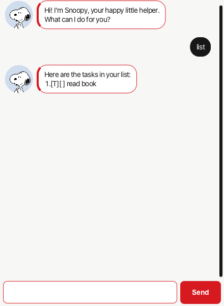

# Snoopy User Guide

Snoopy is a cheerful desktop chatbot that helps you keep track of todos, deadlines, and events through
short text commands. Your tasks are saved automatically, so they are still available the next time you
open the app.



## Quick start

1. Open the project folder in a terminal.
2. Run `./gradlew run`.
3. Type a command in the field at the bottom of the window.
4. Press **Enter** or click **Send**.

Dates must use the `yyyy-MM-dd` format, such as `2026-09-17`.

## Commands

| Action | Command | Example |
| --- | --- | --- |
| Add a todo | `todo <description>` | `todo borrow book` |
| Add a deadline | `deadline <description> /by <date>` | `deadline submit report /by 2026-09-20` |
| Add an event | `event <description> /from <date> /to <date>` | `event project meeting /from 2026-09-21 /to 2026-09-22` |
| Show all tasks | `list` | `list` |
| Mark a task complete | `mark <number>` | `mark 2` |
| Mark a task incomplete | `unmark <number>` | `unmark 2` |
| Delete a task | `delete <number>` | `delete 2` |
| Find tasks | `find <keyword>` | `find report` |
| Exit Snoopy | `bye` | `bye` |

Task numbers are shown by `list`. They can change after a task is deleted, so run `list` again before
using `mark`, `unmark`, or `delete` if you are unsure.

## Working with tasks

### Todos

A todo has no date:

```text
todo buy groceries
```

### Deadlines

Place `/by` before the due date:

```text
deadline submit assignment /by 2026-09-25
```

### Events

Place `/from` before the start date and `/to` before the end date. The end date cannot be earlier than
the start date.

```text
event reading week /from 2026-10-03 /to 2026-10-11
```

## If a command is rejected

Snoopy displays an error message when a command is incomplete or invalid. Check that:

- the task description is not empty;
- task numbers are positive numbers shown by `list`;
- dates exist and use `yyyy-MM-dd`;
- deadline and event commands contain their required `/by`, `/from`, and `/to` markers.

An invalid command does not change your task list, so you can correct it and try again.

## Exiting

Enter `bye` to close Snoopy after its farewell message. You can also use the window's close button.
